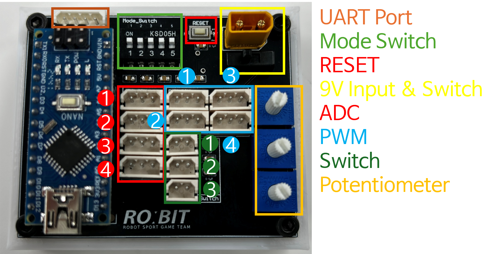

# K-robot-open-source

## ⚠️ 주의 ⚠️
- 이 레포지토리는 오픈소스 라이선스 CC BY-NC (Creative Commons Attribution-NonCommercial)를 따릅니다. 자세한 내용은 [LICENSE](LICENSE) 파일을 참고하세요.
- **상업적 이용을 엄격하게 금지합니다.**
- 해당 레포지토리 사용 시 **반드시 출처를 표시**해야 합니다.

## 빠른 시작

**1. [회로도](K-robot-circuit-Schematic.pdf)**  
**2. [타이머 프로그램](https://github.com/mjlee111/K-robot-opensource/releases/download/v1.0/Windows_Qt_6_8_0_MinGW_64_bit-Release.zip)**  
**3. [아두이노 소스 코드](Arduino_firmware/K-Robot/K-Robot.ino)**  
**4. [K 로봇대회 관련](http://www.cdyouth.or.kr/sub05/sub02.php)**  
## 회로 사용방법
계측기 회로의 경우 Arduino Nano를 사용합니다. 핀 배치 및 소자의 연결과 같은 경우 [K-robot-circuit-Schematic.pdf](K-robot-circuit-Schematic.pdf) 파일을 참고하세요.

- 부품 목록

| 소자명                               | 개수 | 가격 [₩] (VAT included) | 구매링크                                                                                     |
|--------------------------------------|------|-------------------------|---------------------------------------------------------------------------------------------|
| 아두이노 나노 호환보드 FT232RL [SZH-EK017] | 1    | 7700                    | [link](https://www.devicemart.co.kr/goods/view?no=1265700)                                  |
| C2012-104K(100nF)-50V                | 9    | 7                       | [link](https://www.devicemart.co.kr/goods/view?no=3516)                                     |
| Hongxing WIW3386P(8mm shaft) Series-10KΩ | 3    | 825                     | [link](https://www.devicemart.co.kr/goods/view?no=37689)                                    |
| 핀헤더소켓 Single 1x15 Straight(2.54mm)  | 2    | 200                     | [link](https://www.devicemart.co.kr/goods/view?no=3585)                                     |
| [MOLEX] 5267-03                      | 8    | 44                      | [link](https://www.devicemart.co.kr/goods/view?no=442)                                      |
| [MOLEX] 5267-02                      | 3    | 33                      | [link](https://www.devicemart.co.kr/goods/view?no=417)                                      |
| [MOLEX] 5267-04                      | 1    | 33                      | [link](https://www.devicemart.co.kr/goods/view?no=419)                                      |
| MSL-1C2P(중) - 4mm                   | 1    | 165                     | [link](https://www.devicemart.co.kr/goods/view?no=38883)                                    |
| 마이크로 택트 스위치 [NW3-A06-B3]      | 1    | 99                      | [link](https://www.devicemart.co.kr/goods/view?no=1322056)                                  |
| XT-30 Female                         | 1    | 660                     | [link](https://www.devicemart.co.kr/goods/view?no=15229856)                                 |
| KSD-05H                               | 1    | 572                     | [link](https://www.devicemart.co.kr/goods/view?no=1779)                                     |

---
 
- 회로 포트

---
 
- 회로 포트 설명

| 포트명 | 설명 |
|--------|------|
| ADC0   | 타이머 Start PSD0 센서 |
| ADC1   | 서보모터 제어 PSD1 센서 |
| ADC2   | 타이머 End PSD2 센서 |
| ADC3   | - |
| PWM0   | 서보모터 제어 PWM |
| PWM1   | - |
| PWM2   | - |
| PWM3   | - |
| Switch0 | 타이머 Start 스위치 |
| Switch1 | 타이머 End 스위치 |
| Switch2 | 미션 완료 스위치 |
| Potentiometer0 | PSD0 센서 임계값 설정 |
| Potentiometer1 | PSD1 센서 임계값 설정 |
| Potentiometer2 | PSD2 센서 임계값 설정 |
---
 
- 모드 설정 방법

각 종목별 모드는 Mode Switch를 통해 설정합니다. On 상태일 경우 설정이 되지 않은 상태입니다.

**1 : Off, 0 : On**

| 종목 | Mode Switch |
|------|-------------|
| 로봇 슈팅 | 10000 |
| 미션형 창작 | 01000 |
| 미로 찾기 | 00100 |
| 블록 코딩 초급 | 00010 |
| 블록 코딩 고급 | 00001 |
| DEBUG | 11111| 

## 프로그램 사용방법
프로그램은 Qt를 기반으로 개발되었습니다. 프로그램 실행 시 프로그램 폴더 내에 있는 `Timer.exe` 파일을 실행하세요.

- 프로그램 다운로드 방법

1. 릴리즈 탭에서 리눅스/윈도우 버전을 다운로드 받으세요.
2. 다운로드 받은 압축 파일을 압축 해제해 주세요.
3. 압축 해제한 폴더 내에 있는 `Timer.exe` 파일을 실행해 주세요.

